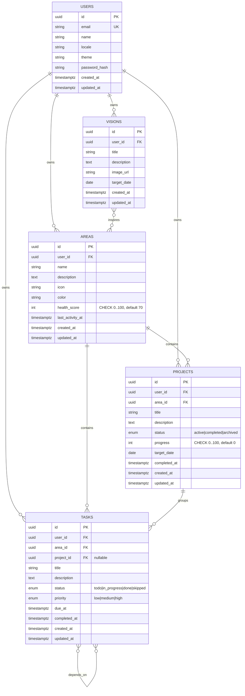

# LifeOS — Database Schema Reference

> Reference document for the LifeOS PostgreSQL schema. Kept in sync with
> Alembic migrations under `backend/alembic/versions/`. Source of truth for
> humans and AI agents picking up the project.

**Current migration head:** `0005` (notifications).
**Database engine:** PostgreSQL 16.
**ORM:** SQLAlchemy 2.0 (declarative).

---

## 1. Entity Relationship Diagram

Two junction tables omitted from the diagram for clarity:

- **`vision_areas`** `(vision_id, area_id)` — composite PK, both FKs `ON DELETE CASCADE`. Plus `created_at`.
- **`task_dependencies`** `(task_id, depends_on_task_id)` — composite PK, both FKs `ON DELETE CASCADE`, CHECK `task_id <> depends_on_task_id`. Plus `created_at`.

---

## 2. Tables

### 2.1 `users`

Single-user during MVP (one seeded row), structured for multi-tenant from day one.

| Column | Type | Null | Default | Notes |
|---|---|---|---|---|
| `id` | UUID | NO | `uuid_generate` | PK |
| `email` | VARCHAR(255) | NO | — | UNIQUE, indexed |
| `name` | VARCHAR(120) | NO | — | Display name |
| `locale` | VARCHAR(10) | NO | `'tr'` | BCP-47 tag |
| `theme` | VARCHAR(20) | NO | `'system'` | `light` / `dark` / `system` |
| `password_hash` | VARCHAR(255) | YES | — | Empty during MVP; populated in Adım 10 |
| `streak_count` | INT | NO | `0` | **CHECK ≥ 0**, system-managed |
| `streak_last_active_date` | DATE | YES | — | UTC date of last completion |
| `longest_streak` | INT | NO | `0` | **CHECK ≥ 0**, all-time best |
| `xp` | INT | NO | `0` | **CHECK ≥ 0** |
| `level` | INT | NO | `1` | **CHECK ≥ 1**, derived from xp via `xp_service.level_for_xp` |
| `created_at` | TIMESTAMPTZ | NO | `now()` | |
| `updated_at` | TIMESTAMPTZ | NO | `now()` | Auto-updated by trigger |

**Indexes:** `ix_users_email`, `uq_users_email` (UNIQUE)
**Seed row:** id `00000000-0000-0000-0000-000000000001`, email `begum.gorucu14@gmail.com`.

### 2.2 `areas`

Persistent life domains. Hierarchy root for projects and tasks.

| Column | Type | Null | Default | Notes |
|---|---|---|---|---|
| `id` | UUID | NO | — | PK |
| `user_id` | UUID | NO | — | FK → `users.id` ON DELETE CASCADE |
| `name` | VARCHAR(120) | NO | — | "Sağlık", "Almanca" |
| `description` | TEXT | YES | — | |
| `icon` | VARCHAR(50) | YES | — | Emoji or icon name |
| `color` | VARCHAR(20) | YES | — | Hex color (UI) |
| `health_score` | INT | NO | `70` | **CHECK 0..100** |
| `last_activity_at` | TIMESTAMPTZ | YES | — | Last time a task completed or activity recorded |
| `created_at` | TIMESTAMPTZ | NO | `now()` | |
| `updated_at` | TIMESTAMPTZ | NO | `now()` | Auto-updated by trigger |

**Indexes:** `ix_areas_user_id`

### 2.3 `visions`

Long-term aspirations. Optionally linked to one or more areas.

| Column | Type | Null | Default | Notes |
|---|---|---|---|---|
| `id` | UUID | NO | — | PK |
| `user_id` | UUID | NO | — | FK → `users.id` CASCADE |
| `title` | VARCHAR(200) | NO | — | "Berlin'de yaşamak" |
| `description` | TEXT | YES | — | |
| `image_url` | VARCHAR(500) | YES | — | URL only — store binaries elsewhere |
| `target_date` | DATE | YES | — | Date-only, no time |
| `created_at` | TIMESTAMPTZ | NO | `now()` | |
| `updated_at` | TIMESTAMPTZ | NO | `now()` | Auto-updated by trigger |

**Indexes:** `ix_visions_user_id`

### 2.4 `vision_areas`

Junction table for the Vision ↔ Area M:N relationship.

| Column | Type | Notes |
|---|---|---|
| `vision_id` | UUID | PK, FK → `visions.id` CASCADE |
| `area_id` | UUID | PK, FK → `areas.id` CASCADE |
| `created_at` | TIMESTAMPTZ | `now()` |

**Indexes:** composite PK + `ix_vision_areas_area_id` (trailing column).

### 2.5 `projects`

Bounded efforts inside an area. Status enum drives kanban view.

| Column | Type | Null | Default | Notes |
|---|---|---|---|---|
| `id` | UUID | NO | — | PK |
| `user_id` | UUID | NO | — | FK → `users.id` CASCADE |
| `area_id` | UUID | NO | — | FK → `areas.id` CASCADE |
| `title` | VARCHAR(200) | NO | — | |
| `description` | TEXT | YES | — | |
| `status` | ENUM `project_status` | NO | `'active'` | active / completed / archived |
| `progress` | INT | NO | `0` | **CHECK 0..100**, auto-computed from tasks |
| `target_date` | DATE | YES | — | Deadline |
| `completed_at` | TIMESTAMPTZ | YES | — | Set when status → completed |
| `created_at` | TIMESTAMPTZ | NO | `now()` | |
| `updated_at` | TIMESTAMPTZ | NO | `now()` | Auto-updated by trigger |

**Indexes:** `ix_projects_user_id`, `ix_projects_area_id`, `ix_projects_status`

### 2.6 `tasks`

Atomic action units. Linked to area (required) and optionally a project.

| Column | Type | Null | Default | Notes |
|---|---|---|---|---|
| `id` | UUID | NO | — | PK |
| `user_id` | UUID | NO | — | FK → `users.id` CASCADE |
| `area_id` | UUID | NO | — | FK → `areas.id` CASCADE |
| `project_id` | UUID | YES | — | FK → `projects.id` ON DELETE SET NULL |
| `title` | VARCHAR(200) | NO | — | |
| `description` | TEXT | YES | — | |
| `status` | ENUM `task_status` | NO | `'todo'` | todo / in_progress / done / skipped |
| `priority` | ENUM `task_priority` | NO | `'medium'` | low / medium / high |
| `due_at` | TIMESTAMPTZ | YES | — | Past dates accepted (overdue badge in UI) |
| `completed_at` | TIMESTAMPTZ | YES | — | Set when status → done |
| `created_at` | TIMESTAMPTZ | NO | `now()` | |
| `updated_at` | TIMESTAMPTZ | NO | `now()` | Auto-updated by trigger |

**Indexes:** `ix_tasks_user_id`, `ix_tasks_area_id`, `ix_tasks_project_id`, `ix_tasks_status`, `ix_tasks_due_at`, `ix_tasks_completed_at`

### 2.7 `task_dependencies`

Junction table for task-blocking-task relationships (DAG).

| Column | Type | Notes |
|---|---|---|
| `task_id` | UUID | PK, FK → `tasks.id` CASCADE. The dependent task. |
| `depends_on_task_id` | UUID | PK, FK → `tasks.id` CASCADE. The blocker. |
| `created_at` | TIMESTAMPTZ | `now()` |

**Constraints:** `CHECK (task_id <> depends_on_task_id)` — self-dependency rejected.
**Indexes:** composite PK + `ix_task_dependencies_depends_on_task_id` (for "what depends on X" queries).
**Cycle prevention:** application-level (service layer BFS before insert). DB does not prevent multi-node cycles.

### 2.8 `daily_activity_logs`

One row per `(user_id, date)`. Incremented on task completion, decremented
on reopen (rows hitting zero are deleted). Drives the heatmap, weekly
chart, and streak detection.

| Column | Type | Null | Default | Notes |
|---|---|---|---|---|
| `id` | UUID | NO | — | PK |
| `user_id` | UUID | NO | — | FK → `users.id` CASCADE |
| `date` | DATE | NO | — | UTC date the activity happened |
| `tasks_completed` | INT | NO | `0` | **CHECK ≥ 0** |
| `created_at` | TIMESTAMPTZ | NO | `now()` | |
| `updated_at` | TIMESTAMPTZ | NO | `now()` | Auto-updated by trigger |

**Indexes:** `ix_daily_activity_logs_user_id`, `ix_daily_activity_logs_date`
**Constraints:** UNIQUE `(user_id, date)` (`uq_daily_activity_logs_user_date`)

---

## 3. Enums

| Enum | Values | Used in |
|---|---|---|
| `project_status` | `active`, `completed`, `archived` | `projects.status` |
| `task_status` | `todo`, `in_progress`, `done`, `skipped` | `tasks.status` |
| `task_priority` | `low`, `medium`, `high` | `tasks.priority` |

When adding a value: write a new Alembic migration with `ALTER TYPE ... ADD VALUE`. Never edit the existing migration.

---

## 4. Triggers & Functions

### `set_updated_at()` (PL/pgSQL)

Returns `NEW` with `updated_at = now()`. Attached as `BEFORE UPDATE` trigger on every timestamped table:
- `trg_users_set_updated_at`
- `trg_areas_set_updated_at`
- `trg_visions_set_updated_at`
- `trg_projects_set_updated_at`
- `trg_tasks_set_updated_at`

**Why DB-level?** SQLAlchemy's `onupdate=func.now()` fires only when ORM emits the UPDATE. Raw SQL bypasses it. The trigger guarantees `updated_at` correctness regardless of how the row is mutated.

Junction tables (`vision_areas`, `task_dependencies`) intentionally have no `updated_at` — links are immutable; create / delete only.

---

## 5. Cascade Behavior (Quick Reference)

| Delete this | What happens |
|---|---|
| `User` | All `areas`, `visions`, `projects`, `tasks` of that user → CASCADE deleted |
| `Area` | All its `projects` and `tasks` → CASCADE deleted. Vision links removed. |
| `Vision` | Vision-area links removed (`vision_areas`). Areas themselves unaffected. |
| `Project` | Its `tasks.project_id` → set to NULL (tasks survive as "orphan tasks") |
| `Task` | Dependency rows referencing it (either side) → CASCADE removed |

**UI implication:** Before deleting an area or project, confirm with the user (cascade can wipe a lot of work).

---

## 6. Business Rules (Service Layer Invariants)

These live in `app/services/` and complement DB constraints:

| Rule | Where enforced | Why |
|---|---|---|
| `health_score` range 0..100 | DB CHECK + `services/health_score._clamp` | Defense in depth |
| `progress` auto-computed from task completion ratio | `services/project_service.recompute_progress` | Users don't set progress directly |
| `last_activity_at` updated when a task in the area is completed | `services/task_service.complete_task` | Drives neglect detection |
| Task can't depend on itself | DB CHECK + service guard | Both layers |
| Task dependency graph is acyclic | `services/task_service.detect_cycle` (BFS) | DB cannot catch multi-node cycles cheaply |
| Every query filtered by `user_id` | Every service function takes `user_id` and includes it in WHERE | Multi-tenant safety; future sharing requires only service-level changes |
| User can't directly mutate `health_score` via PATCH | `AreaUpdate` Pydantic schema excludes the field | Score reflects activity, not user input |

---

## 7. Query Patterns

- **Pagination:** `LIMIT/OFFSET` with `?limit=20&offset=0` (default 20, max 100). Cursor-based pagination if data grows past ~1M rows.
- **Ordering:** Most list endpoints `ORDER BY created_at DESC`. Tasks list will additionally order by `due_at`.
- **Eager loading:** Service layer uses SQLAlchemy `selectinload()` for one-to-many relationships in list responses to avoid N+1 queries (e.g. `selectinload(Task.depends_on)`, `selectinload(Vision.areas)`).
- **Aggregations:** Counts (e.g. `tasks_count` per area) currently use per-row COUNT subqueries. Fine for MVP (<50 areas). Optimize with grouped subquery or materialized view if dashboards slow down.

---

## 8. Future-Feature Readiness

These features are NOT in the schema today but the current design accepts them as additive migrations (no breaking changes needed):

| Feature | Migration sketch |
|---|---|
| **Subtasks** | `ALTER TABLE tasks ADD COLUMN parent_task_id UUID NULL REFERENCES tasks(id) ON DELETE CASCADE` + recursive CTE for tree queries |
| **Recurring tasks** | `ALTER TABLE tasks ADD COLUMN recurrence_rule VARCHAR(200), series_id UUID` (RFC 5545 RRULE) OR separate `task_templates` table |
| **Comments / notes** | New `comments(id, entity_type, entity_id, user_id, body, created_at)` polymorphic table |
| **Tags** | New `tags(id, name, color)` + `taggable(tag_id, entity_type, entity_id)` |
| **Attachments** | New `attachments(id, entity_type, entity_id, storage_url, mime, size, ...)` |
| **Activity feed** | New `events(id, user_id, actor_id, verb, entity_type, entity_id, payload JSONB, created_at)` |
| **Sharing** | New `area_shares(area_id, shared_with_user_id, role)`; service layer queries shift from `user_id = me` to `user_id = me OR id IN (shares_for_me)` |
| **Project templates** | `ALTER TABLE projects ADD COLUMN is_template BOOLEAN DEFAULT false` OR separate `project_templates` table |

> The reason these are not blocked: every table has a UUID primary key (composable with polymorphic associations) and a `user_id` column (multi-tenant from day one).

---

## 9. Migration History

| Version | Title | Adds |
|---|---|---|
| `0001` | Initial schema | users, visions, areas, projects, tasks, vision_areas, task_dependencies + 3 enums + seed user |
| `0002` | Schema hardening | 3 CHECK constraints, 6 indexes, `set_updated_at` trigger on 5 tables |
| `0003` | Gamification | 5 user columns (streak/xp/level), 4 CHECK constraints, new `daily_activity_logs` table |
| `0004` | Pool + achievements + snapshots | New `daily_pool_items`, `user_achievements`, `area_health_snapshots` tables + `pool_reason` enum |
| `0005` | Notifications | New `notifications` table + `notification_type` enum + 6 `notif_*` preference columns on users |

---

## 10. Conventions

- **All FKs explicitly indexed** (PostgreSQL doesn't auto-index FKs).
- **All timestamps are `TIMESTAMPTZ`** (timezone-aware). Application uses UTC; UI converts to local time.
- **Enum types are named** (`name="project_status"`) so they can be dropped explicitly in downgrades.
- **Migration enum handling:** never call `enum.create()` explicitly; let `op.create_table` create them and drop them explicitly only in `downgrade()`. (See CLAUDE.md §7.3 Migration Konvansiyonları.)
- **Seed data:** use `op.bulk_insert()` with `sa.table()`, never `op.execute(sa.text(...))` for INSERTs. (See CLAUDE.md §7.3.)
